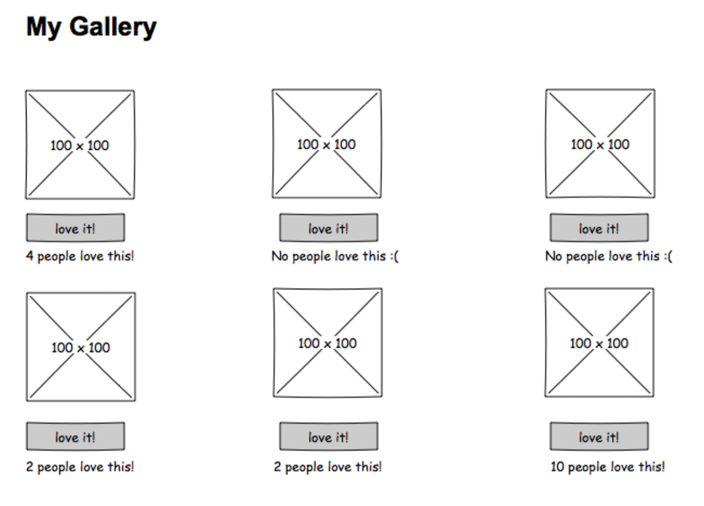

# Gallery of My life (React)

This is an ongoing React project I'm working on as one of the weekend challenges for Prime Digital Academy

## Description

My Life uses full-stack tech to allow users to interact with a gallery of photos and events from my life. Elements are submitted on the DOM, sent through to the server, and then called back to be displayed.

## Tech

- React
- Axios
- Node.js
- Express.js
- Postgres
- SQL (Postico)

## Original wireframes
These were provided by Prime at the start of the assignment

## My checklist

[ ] Use `axios` to retrieve (`GET`) data from to `/gallery` and store it in `App.jsx`.
[ ] Create a new **component** for the `GalleryList` and pass it the gallery data stored in `App` via `props`.
    [ ] Iterate (loop over) the list of gallery data
    [ ] Make GalleryItems
[ ] Create a new **component** called `GalleryItem.jsx` and pass it the individual gallery item via `props`. 
    [ ] Update the `GalleryList` to use this component to display an image.
    [ ] Swap the image with the description on click. Use [conditional rendering](https://reactjs.org/docs/conditional-rendering.html).
    [ ] Display the number likes for each item and include a like button.
    [ ] When the like button is clicked, use `Axios` to update (`PUT`) the like count `/gallery/like/:id`.
    [ ] Update the gallery each time a like button is clicked.
